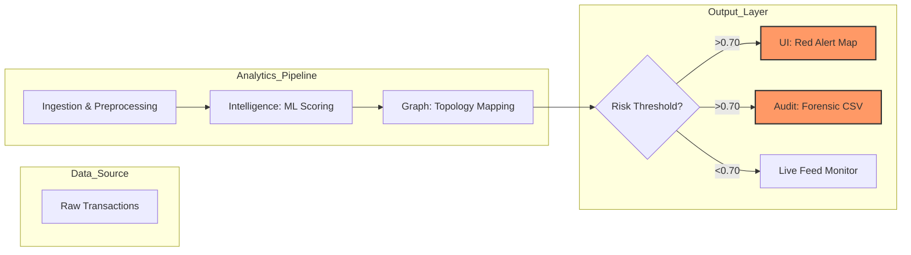

# Topic: Behavioral Machine Learning and Graph-Based Forensics for Detecting Digital Financial Crimes and Money Laundering Cycles

## 📌 Project Overview

ScamGuard AI is a next-generation financial forensics prototype designed to detect sophisticated digital scams and money laundering operations in real-time. By combining Machine Learning (Random Forest) with Graph Theory (Network Science), the platform identifies fraudulent behavior and traces the flow of illicit funds through complex multi-account networks.

## 🕵️ The Problem: The "Mule" Crisis

Modern scammers utilize Money Mule Networks. Stolen funds are rarely withdrawn immediately; instead, they are fragmented across dozens of accounts to bypass "Transaction Limit" triggers.

- Point-to-Point Detection: Fails because each individual transfer looks "normal."

- The Solution: Our system analyzes the Structural Topology of the network to find where these fragmented paths converge.

## 🚀 Key Features

- Predictive Scam Detection: AI-powered scoring based on transaction velocity and behavioral anomalies.

- Graph-Based Money Tracing: Visualizes the "Money Map" to identify the source and destination of stolen funds.

- Laundering Cycle Detection: Automatically detects "Circular Routing" (A → B → C → A) used to wash illicit gains.

- Investigative Search: Deep-dive forensics on specific Account IDs to generate risk profiles.

- Real-Time Alerts: Live "Toast" notifications and sidebar logs for high-risk activity.

- Forensic Reporting: One-click export of audit-ready CSV reports for law enforcement (AML Compliance).

## 🛠️ Technical Architecture

-  Language: Python 3.9+

- AI Engine: Scikit-Learn (Random Forest Classifier)

- Graph Engine: NetworkX (Directed Graphs & Cycle Detection)

 - Dashboard: Streamlit (Web UI)

- Visualization: Matplotlib / Pyplot

## 📊 Analytical Methodology

1. Scam Analytics (ML)

The system extracts features such as Transaction Velocity:

$$V = \frac{Amount}{Time \Delta}$$

High velocity coupled with high amounts triggers a "Red Flag" alert.

2. Fund Traceability (Graph Theory)

The network is modeled as a Directed Graph $G = (V, E)$.

- Nodes ($V$): Financial accounts.

- Edges ($E$): Fund transfers, weighted by risk and amount.

- Cycle Detection: Uses Johnson's Algorithm to find loops that indicate money laundering.

## 🏗️ System Architecture

ScamGuard AI follows a modular, pipeline-oriented architecture designed to handle high-velocity financial data. The system decouples data ingestion from analytical processing to ensure low-latency detection.

### 🧩 Component Breakdown

| Component | Responsibility | Technology Stack |
| :--- | :--- | :--- |
| **Ingestion Engine** | Simulates and preprocesses raw transaction streams, calculating critical features like "Time Delta" and "Transaction Velocity." | `Python` / `Pandas` / `NumPy` |
| **Intelligence Layer** | The predictive "Brain." Utilizes a **Random Forest Classifier** to assign a probability risk score ($R \in [0,1]$) to every transfer. | `Scikit-Learn` |
| **Graph Layer** | Maps transactions as Directed Edges. Runs **Johnson's Algorithm** to identify hidden laundering loops and "Mule" node clusters. | `NetworkX` |
| **Visualization UI** | The Investigative Control Center. Renders interactive money-trail maps and live risk-monitoring dashboards. | `Streamlit` |
| **Audit Engine** | Generates timestamped forensic reports and exports high-risk subgraphs for law enforcement or AML compliance. | `CSV` / `Logging` |

### 🔄 Logical Data Flow
The framework operates as a continuous pipeline:
1. **Feature Engineering:** Raw inputs (Sender, Receiver, Amount) are converted into velocity vectors.
2. **Behavioral Inference:** The AI evaluates the vector against known "Scam Fingerprints."
3. **Topological Analysis:** Flagged transactions are projected onto a Graph to detect multi-hop routing or circular laundering.
4. **Actionable Alerting:** High-risk clusters are visualized in the UI and archived by the Audit Engine.

### 🗺️ System Topology 

## 🖥️ Dashboard Preview

## 📜 AML Compliance & Legal Value

ScamGuard AI is built with the FATF (Financial Action Task Force) recommendations in mind. 

The system provides:

- STR (Suspicious Transaction Reporting): Automated generation of alert logs.

- KYT (Know Your Transaction): Deep-dive history of fund origins.

- Evidence Preservation: A tamper-evident log of all AI-detected anomalies.
